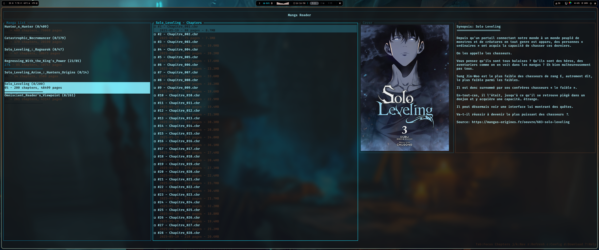
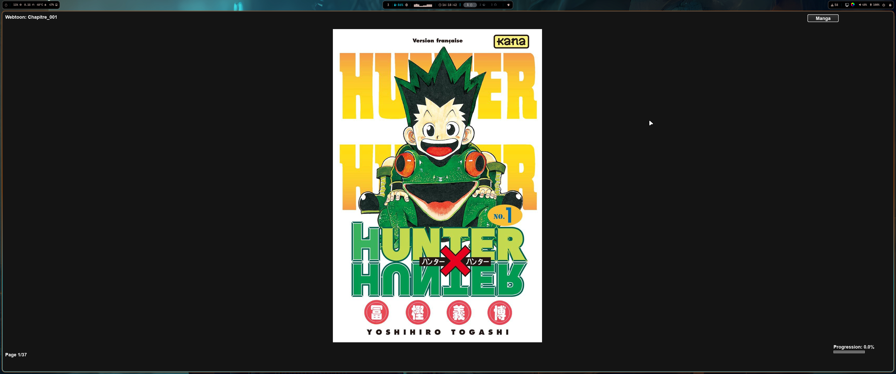
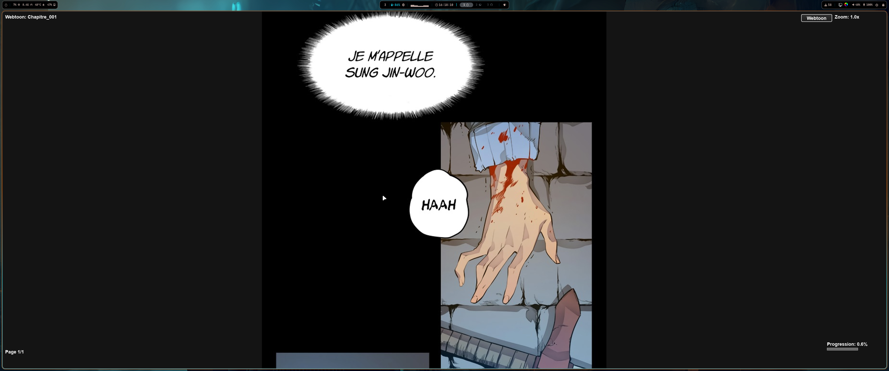
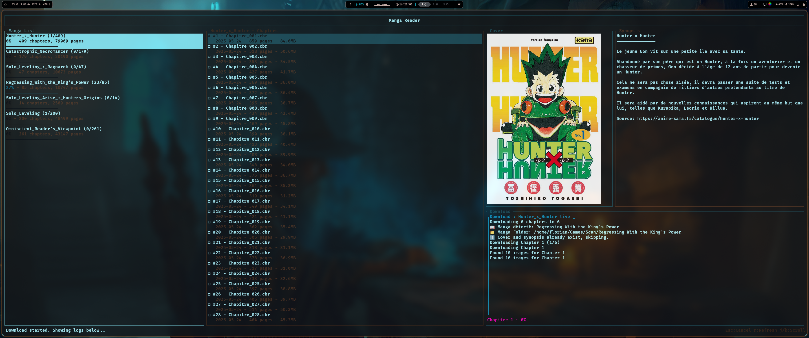

# Manga Reader

Une application complète en Rust et Python pour organiser, parcourir et lire vos mangas et webtoons en local. Avec une interface utilisateur intuitive basée sur Ratatui (TUI) et un visualiseur de chapitres utilisant Pygame, ce projet offre une expérience fluide pour les amateurs de mangas.



## ✨ Fonctionnalités

### 🖥️ Interface TUI (Terminal User Interface)
- Parcourez vos mangas dans une liste claire avec filtres
- Visualisez les chapitres d'un manga sélectionné avec des détails (numéro, titre, date, taille, état de lecture)
- Affichez une couverture et un synopsis pour chaque manga
- Navigation fluide avec raccourcis clavier (j/k pour naviguer, Tab pour changer de focus, etc.)

### 📖 Lecteur de chapitres
- Visualisez les chapitres en mode **Webtoon** (défilement vertical) ou **Manga** (pagination) via Pygame
- Support des formats **CBR**, **CBZ** et **PDF**
- Zoom et défilement personnalisables pour une lecture confortable
- Cache optimisé pour un chargement rapide des images

### 📥 Téléchargement de chapitres
- Téléchargez des chapitres depuis **mangas-origines.fr** et **anime-sama.fr**
- Crée automatiquement des fichiers CBR avec les images téléchargées
- Récupère la couverture et le synopsis du manga pour enrichir votre bibliothèque

### 💾 Gestion locale
- Organisez vos mangas dans un répertoire local
- Suivez les chapitres lus et non lus via un fichier de configuration
- Prise en charge des archives compressées (CBR/CBZ) et des PDF

## 🛠️ Prérequis

### Système
- **Linux** (testé sur Arch linux) ou **macOS**
- Windows n'est pas encore officiellement supporté

### Logiciels requis
- **Rust** : Version 1.65 ou supérieure
- **Python** : Version 3.8 ou supérieure

### Dépendances système
```bash
# Ubuntu/Debian
sudo apt install libx11-dev libxcb1-dev libxkbcommon-dev python3-pip python3-dev libjpeg-dev zlib1g-dev unrar poppler-utils

# macOS
brew install python3 unrar poppler
```

## 🚀 Installation

1. **Cloner le dépôt**
   ```bash
   git clone https://github.com/Eaquo/webtoon_manga-tui_local.git
   cd manga-reader
   ```

2. **Rendre le script d'installation exécutable**
   ```bash
   chmod +x install.sh
   ```

3. **Exécuter le script d'installation**
   ```bash
   ./install.sh
   ```

Le script `install.sh` :
- Installe les dépendances système (Rust, Python, unrar, poppler-utils)
- Compile l'application Rust (`cargo build --release`)
- Installe les dépendances Python via pip (`requirements.txt`)

4. **Vérifier l'installation**
   - Assurez-vous que l'exécutable Rust est généré dans `target/release/manga-reader`
   - Vérifiez que les scripts Python sont exécutables

## 📱 Utilisation

### Lancer l'application

```bash
 Manga-reader
```

### Raccourcis clavier - Interface TUI

| Touche | Action |
|--------|--------|
| `j/k` | Naviguer dans la liste des mangas ou chapitres |
| `Tab` | Basculer entre la liste des mangas et des chapitres |
| `Enter` | Ouvrir un chapitre |
| `d` | Passer en mode téléchargement |
| `q` | Quitter l'application |

### Lecteur de chapitres

#### Mode Manga (pagination)


#### Mode Webtoon (défilement vertical)


### Raccourcis clavier - Lecteur

| Touche | Action |
|--------|--------|
| `w` | Passer en mode Webtoon |
| `m` | Passer en mode Manga |
| `+/-` | Zoomer/dézoomer (mode Webtoon) |
| `PageUp/PageDown` | Naviguer dans les pages |
| `Home/End` | Aller au début/fin du chapitre |
| `q` | Quitter le lecteur |

### Téléchargement de chapitres



1. Dans l'interface TUI, appuyez sur `d` pour entrer en mode téléchargement
2. Saisissez l'URL du manga (ex: `https://mangas-origines.fr/oeuvre/nom-du-manga/chapitre-1`)
3. Appuyez sur `Tab` pour passer au champ des chapitres
4. Entrez les numéros de chapitres (ex: `1-3,5` pour les chapitres 1, 2, 3 et 5)
5. Appuyez sur `Enter` pour lancer le téléchargement

**Exemple de commande manuelle :**
```bash
python3 webtoon-dl.py "https://mangas-origines.fr/oeuvre/nom-du-manga/chapitre-1" "1-3,5" -o ~/Documents/Scan
```

## 📂 Structure du projet

```
manga-reader/
├── app.rs              # Interface principale TUI (Rust)
├── manga-live.py       # Visualiseur de chapitres (Pygame)
├── webtoon-dl.py       # Script de téléchargement
├── install.sh          # Script d'installation
├── requirements.txt    # Dépendances Python
└── screenshots/        # Captures d'écran
```

## ⚙️ Configuration

### Fichier de configuration

L'application crée automatiquement `~/.config/manga_reader/config.json` :

```json
{
  "last_manga_dir": "/home/user/Mangas",
  "read_chapters": [],
  "open_command": null,
  "settings": {
    "prefer_external": false,
    "auto_mark_read": true,
    "default_provider": "manual",
    "enable_image_rendering": true
  },
  "last_download_url": null,
  "last_downloaded_chapters": []
}
```

### Organisation des mangas

```
/home/user/Mangas/
├── Nom_du_Manga_1/
│   ├── cover.jpg
│   ├── synopsis.txt
│   ├── Chapitre_001.cbr
│   └── Chapitre_002.cbr
└── Nom_du_Manga_2/
    ├── cover.jpg
    ├── synopsis.txt
    └── Chapitre_001.pdf
```

## 🔧 Dépannage

### L'interface TUI ne charge pas les mangas
- Vérifiez que `last_manga_dir` dans `config.json` pointe vers un répertoire valide
- Assurez-vous que le répertoire contient des fichiers CBR/CBZ/PDF
- Exécutez avec `RUST_LOG=debug ./target/release/manga-reader /chemin/vers/mangas`

### Erreur lors du téléchargement
- Vérifiez que l'URL est correcte et que le site est accessible
- Assurez-vous que `cloudscraper` est installé : `pip install -r requirements.txt`
- Consultez les logs en exécutant `python3 webtoon-dl.py` manuellement

### Le lecteur Pygame ne s'ouvre pas
- Vérifiez que `unrar` et `poppler-utils` sont installés
- Assurez-vous que le fichier CBR/CBZ/PDF est valide

## 📄 Licence

Ce projet est distribué sous la licence MIT. Voir le fichier [LICENSE](LICENSE) pour plus de détails.

## 👨‍💻 Crédits

Développé par [Wax-dred](https://github.com/wax-dred). Inspiré par la passion pour les mangas et les webtoons !

---

⚠️ **Note importante** : Les téléchargements sont destinés à un usage personnel et à la lecture locale.
